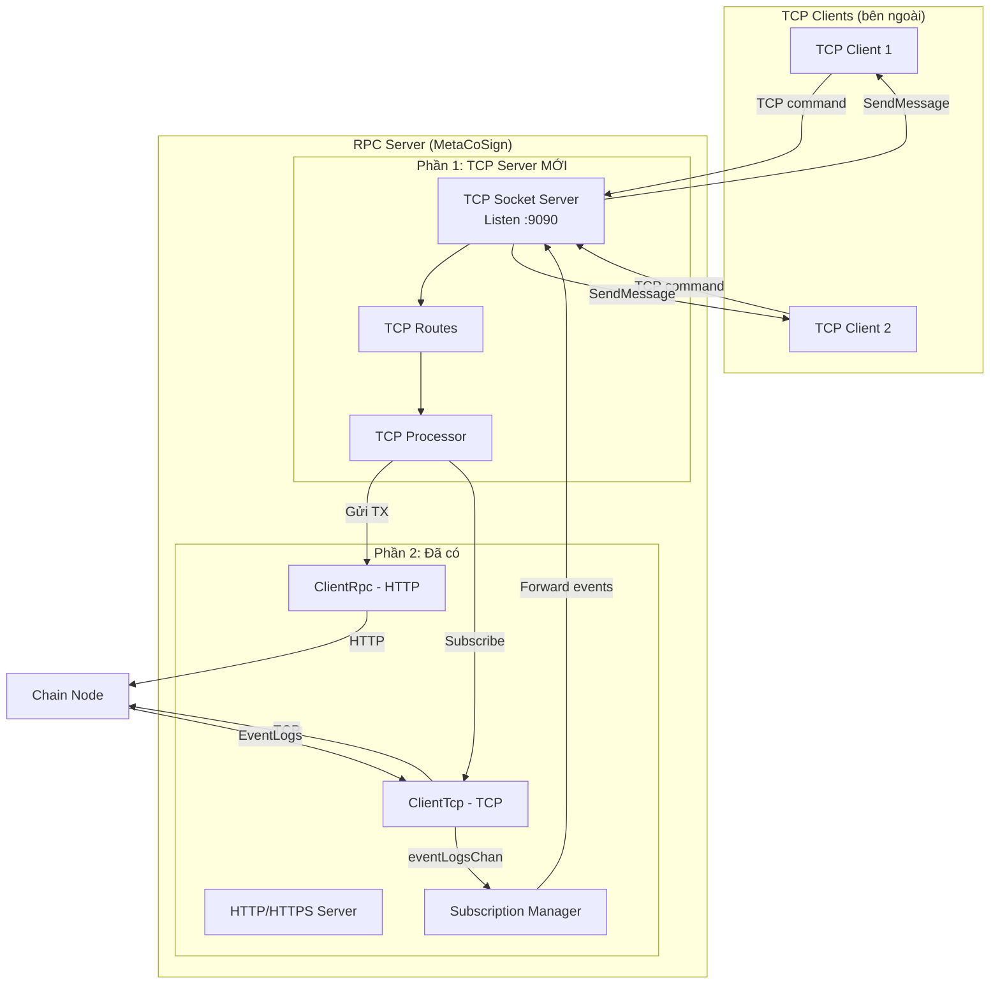
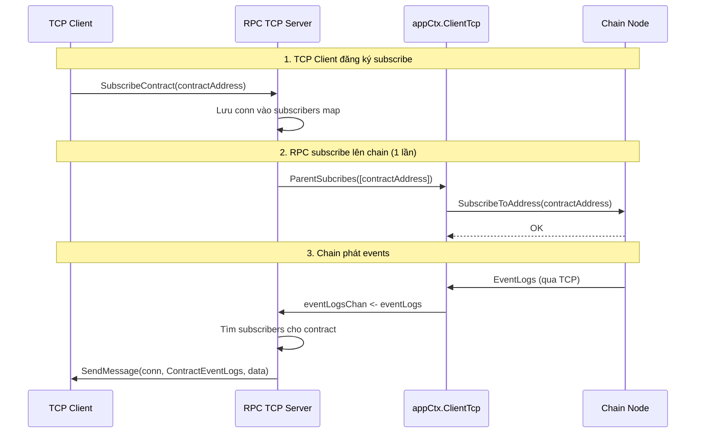

# Tài liệu tích hợp TCP Server vào RPC Client

## Tổng quan kiến trúc



---

## Phần 1: TCP Server — Nhận request & gửi transaction

### Bước 1.1: Thêm config

**File:** `cmd/rpc-client/config/config.go`

```go
type Config struct {
    // ... existing fields ...
    TCPListenAddress string `json:"tcp_listen_address"` // VD: ":9090"
}
```

**File:** `cmd/rpc-client/config-rpc.json`

```json
{
    "tcp_listen_address": ":9090",
    ...
}
```

### Bước 1.2: Tạo TCP commands

**File MỚI:** `cmd/rpc-client/tcp_server/command/commands.go`

```go
package command

const (
    // Nhận từ TCP client
    SendRawTransaction = "SendRawTransaction" // Gửi raw ETH tx (giống HTTP flow)
    SendMetaTransaction = "SendMetaTransaction" // Gửi Meta TX đã build + ký BLS
    SubscribeContract   = "SubscribeContract"   // Đăng ký lắng nghe events
    UnsubscribeContract = "UnsubscribeContract" // Hủy đăng ký
    
    // Trả về cho TCP client
    TransactionResult  = "TransactionResult"  // Kết quả gửi TX
    ContractEventLogs  = "ContractEventLogs"  // Events từ contract
    ErrorResponse      = "ErrorResponse"      // Lỗi
)
```

### Bước 1.3: Tạo TCP Routes

**File MỚI:** `cmd/rpc-client/tcp_server/routes/routes.go`

> [!NOTE]
> Pattern giống hệt `observer/routes/routes.go`

```go
package routes

import (
    "github.com/meta-node-blockchain/meta-node/cmd/rpc-client/tcp_server/command"
    "github.com/meta-node-blockchain/meta-node/cmd/rpc-client/tcp_server/processor"
    t_network "github.com/meta-node-blockchain/meta-node/types/network"
)

func InitRoutes(
    routes map[string]func(t_network.Request) error,
    limits map[string]int,
    proc *processor.TCPProcessor,
) {
    // Transaction routes
    routes[command.SendRawTransaction]  = proc.ProcessSendRawTransaction
    routes[command.SendMetaTransaction] = proc.ProcessSendMetaTransaction
    
    // Subscription routes
    routes[command.SubscribeContract]   = proc.ProcessSubscribeContract
    routes[command.UnsubscribeContract] = proc.ProcessUnsubscribeContract
}
```

### Bước 1.4: Tạo TCP Processor

**File MỚI:** `cmd/rpc-client/tcp_server/processor/processor.go`

```go
package processor

import (
    "encoding/json"
    "fmt"
    "sync"

    "github.com/ethereum/go-ethereum/common"
    "github.com/meta-node-blockchain/meta-node/cmd/rpc-client/app"
    "github.com/meta-node-blockchain/meta-node/cmd/rpc-client/handlers"
    "github.com/meta-node-blockchain/meta-node/cmd/rpc-client/tcp_server/command"
    "github.com/meta-node-blockchain/meta-node/pkg/logger"
    "github.com/meta-node-blockchain/meta-node/pkg/network"
    t_network "github.com/meta-node-blockchain/meta-node/types/network"
)

type TCPProcessor struct {
    appCtx        *app.Context
    messageSender t_network.MessageSender
    
    // Subscription management
    mu            sync.RWMutex
    // contract address → list of TCP connections đang subscribe
    subscribers   map[common.Address][]t_network.Connection
}

func NewTCPProcessor(
    appCtx *app.Context,
    messageSender t_network.MessageSender,
) *TCPProcessor {
    return &TCPProcessor{
        appCtx:        appCtx,
        messageSender: messageSender,
        subscribers:   make(map[common.Address][]t_network.Connection),
    }
}

// ============================================================
// ROUTE 1: ProcessSendRawTransaction
// TCP client gửi raw ETH transaction hex → RPC gọi HTTP lên chain
// ============================================================
func (p *TCPProcessor) ProcessSendRawTransaction(req t_network.Request) error {
    // 1. Lấy raw transaction hex từ message body
    rawTxHex := string(req.Message().Body())
    
    logger.Info("[TCP] SendRawTransaction from %s", req.Connection().RemoteAddrSafe())
    
    // 2. Gọi TRỰC TIẾP vào handler đã có — reuse toàn bộ logic
    result := handlers.ProcessSendRawTransaction(p.appCtx, rawTxHex, 1)
    
    // 3. Serialize kết quả
    resultBytes, err := json.Marshal(result)
    if err != nil {
        return p.sendError(req.Connection(), "Failed to marshal result")
    }
    
    // 4. Trả kết quả về TCP connection
    return p.messageSender.SendBytes(
        req.Connection(), 
        command.TransactionResult, 
        resultBytes,
    )
}

// ============================================================
// ROUTE 2: ProcessSendMetaTransaction
// TCP client gửi Meta TX đã build + ký BLS → RPC verify → gửi chain
// ============================================================
func (p *TCPProcessor) ProcessSendMetaTransaction(req t_network.Request) error {
    metaTxBytes := req.Message().Body()
    
    logger.Info("[TCP] SendMetaTransaction from %s, size=%d", 
        req.Connection().RemoteAddrSafe(), len(metaTxBytes))
    
    // 1. Gửi trực tiếp lên chain qua HTTP binary endpoint
    //    (BLS verification sẽ do chain xử lý)
    result := p.appCtx.ClientRpc.SendRawTransactionBinary(
        metaTxBytes, nil, nil, nil, nil,
    )
    
    // 2. Serialize & trả kết quả
    resultBytes, err := json.Marshal(result)
    if err != nil {
        return p.sendError(req.Connection(), "Failed to marshal result")
    }
    
    return p.messageSender.SendBytes(
        req.Connection(),
        command.TransactionResult,
        resultBytes,
    )
}

// ============================================================
// ROUTE 3: ProcessSubscribeContract
// TCP client đăng ký lắng nghe events từ contract
// ============================================================
func (p *TCPProcessor) ProcessSubscribeContract(req t_network.Request) error {
    contractAddr := common.BytesToAddress(req.Message().Body())
    conn := req.Connection()
    
    logger.Info("[TCP] SubscribeContract %s from %s", 
        contractAddr.Hex(), conn.RemoteAddrSafe())
    
    p.mu.Lock()
    p.subscribers[contractAddr] = append(p.subscribers[contractAddr], conn)
    p.mu.Unlock()
    
    return nil
}

// ============================================================
// ROUTE 4: ProcessUnsubscribeContract
// ============================================================
func (p *TCPProcessor) ProcessUnsubscribeContract(req t_network.Request) error {
    contractAddr := common.BytesToAddress(req.Message().Body())
    conn := req.Connection()
    
    p.mu.Lock()
    defer p.mu.Unlock()
    
    conns := p.subscribers[contractAddr]
    for i, c := range conns {
        if c == conn {
            p.subscribers[contractAddr] = append(conns[:i], conns[i+1:]...)
            break
        }
    }
    
    logger.Info("[TCP] UnsubscribeContract %s from %s", 
        contractAddr.Hex(), conn.RemoteAddrSafe())
    return nil
}

// ============================================================
// BroadcastEventLogs — Gọi từ event listener goroutine
// Gửi event logs tới tất cả TCP connections đã subscribe
// ============================================================
func (p *TCPProcessor) BroadcastEventLogs(contractAddr common.Address, eventLogBytes []byte) {
    p.mu.RLock()
    conns := p.subscribers[contractAddr]
    p.mu.RUnlock()
    
    for _, conn := range conns {
        if conn.IsConnect() {
            err := p.messageSender.SendBytes(conn, command.ContractEventLogs, eventLogBytes)
            if err != nil {
                logger.Warn("[TCP] Failed to send event to %s: %v", 
                    conn.RemoteAddrSafe(), err)
            }
        }
    }
}

// RemoveConnection — Gọi khi TCP client disconnect, cleanup subscriptions
func (p *TCPProcessor) RemoveConnection(conn t_network.Connection) {
    p.mu.Lock()
    defer p.mu.Unlock()
    
    for addr, conns := range p.subscribers {
        for i, c := range conns {
            if c == conn {
                p.subscribers[addr] = append(conns[:i], conns[i+1:]...)
                break
            }
        }
        if len(p.subscribers[addr]) == 0 {
            delete(p.subscribers, addr)
        }
    }
}

func (p *TCPProcessor) sendError(conn t_network.Connection, msg string) error {
    return p.messageSender.SendBytes(conn, command.ErrorResponse, []byte(msg))
}
```

### Bước 1.5: Tích hợp vào `main.go`

**File:** `cmd/rpc-client/main.go`

Thêm sau dòng `logger.Info("RPC Reverse Proxy initialized successfully")` (~line 67):

```go
import (
    // ... existing imports ...
    ethCommon "github.com/ethereum/go-ethereum/common"
    "github.com/meta-node-blockchain/meta-node/cmd/rpc-client/tcp_server/routes"
    "github.com/meta-node-blockchain/meta-node/cmd/rpc-client/tcp_server/processor"
    "github.com/meta-node-blockchain/meta-node/pkg/bls"
    "github.com/meta-node-blockchain/meta-node/pkg/network"
    t_network "github.com/meta-node-blockchain/meta-node/types/network"
)

// === TCP Server Setup ===
var tcpProcessor *processor.TCPProcessor

if cfg.TCPListenAddress != "" {
    bls.Init()
    keyPair := bls.NewKeyPair(ethCommon.FromHex(cfg.PrivateKey))
    
    connectionsManager := network.NewConnectionsManager()
    messageSender := network.NewMessageSender("1.0.0")
    
    // Create processor
    tcpProcessor = processor.NewTCPProcessor(appCtx, messageSender)
    
    // Init routes
    r := make(map[string]func(t_network.Request) error)
    limits := make(map[string]int)
    routes.InitRoutes(r, limits, tcpProcessor)
    
    // Create handler & socket server
    handler := network.NewHandler(r, limits)
    socketServer, err := network.NewSocketServer(
        nil,
        keyPair,
        connectionsManager,
        handler,
        "RPC_CLIENT",
        "1.0.0",
    )
    if err != nil {
        log.Fatalf("FATAL: Failed to create TCP socket server: %v", err)
    }
    
    // Cleanup subscriptions khi TCP client disconnect
    socketServer.AddOnDisconnectedCallBack(func(conn t_network.Connection) {
        tcpProcessor.RemoveConnection(conn)
    })
    
    // Listen TCP
    serverRunning = true
    wg.Add(1)
    go func() {
        defer wg.Done()
        logger.Info("Starting TCP server on %s", cfg.TCPListenAddress)
        if err := socketServer.Listen(cfg.TCPListenAddress); err != nil {
            logger.Error("TCP server error: %v", err)
        }
    }()
}
```

---

## Phần 2: Event Subscription — Lắng nghe sự kiện contract

### Cách hoạt động



### Bước 2.1: Event Listener goroutine

Thêm vào `main.go`, sau khi khởi tạo TCP server:

```go
// === Event Subscription Forwarding ===
if tcpProcessor != nil {
    // Lấy eventLogsChan từ ClientTcp handler
    eventLogsChan := appCtx.ClientTcp.GetEventLogsChan()
    
    // Goroutine lắng nghe events từ chain → forward tới TCP clients
    go func() {
        logger.Info("Starting TCP event subscription forwarder...")
        for eventLogs := range eventLogsChan {
            // Parse event logs để tìm contract address
            for _, eventLog := range eventLogs.EventLogList() {
                contractAddr := eventLog.Address()
                
                // Serialize event log
                eventBytes, err := eventLogs.Marshal()
                if err != nil {
                    logger.Error("Failed to marshal event logs: %v", err)
                    continue
                }
                
                // Broadcast tới tất cả TCP connections đã subscribe contract này
                tcpProcessor.BroadcastEventLogs(contractAddr, eventBytes)
            }
        }
    }()
}
```

### Bước 2.2: Subscribe contract lên chain khi TCP client yêu cầu

Trong `processor.go`, update `ProcessSubscribeContract`:

```go
func (p *TCPProcessor) ProcessSubscribeContract(req t_network.Request) error {
    contractAddr := common.BytesToAddress(req.Message().Body())
    conn := req.Connection()
    
    logger.Info("[TCP] SubscribeContract %s from %s", 
        contractAddr.Hex(), conn.RemoteAddrSafe())
    
    p.mu.Lock()
    isFirstSubscriber := len(p.subscribers[contractAddr]) == 0
    p.subscribers[contractAddr] = append(p.subscribers[contractAddr], conn)
    p.mu.Unlock()
    
    // Nếu là subscriber đầu tiên cho contract này → subscribe lên chain
    if isFirstSubscriber {
        logger.Info("[TCP] First subscriber for %s, subscribing to chain...", contractAddr.Hex())
        _, err := p.appCtx.ClientTcp.ParentSubcribes([]common.Address{contractAddr})
        if err != nil {
            logger.Error("[TCP] Failed to subscribe to chain for %s: %v", contractAddr.Hex(), err)
            return err
        }
    }
    
    return nil
}
```

---

## Phần 3: Cấu trúc thư mục cuối cùng

```
cmd/rpc-client/
├── main.go                          ← SỬA: thêm TCP server init
├── config/
│   └── config.go                    ← SỬA: thêm TCPListenAddress
├── config-rpc.json                  ← SỬA: thêm tcp_listen_address
├── tcp_server/                      ← MỚI
│   ├── command/
│   │   └── commands.go              ← Định nghĩa commands
│   ├── routes/
│   │   └── routes.go                ← Đăng ký routes
│   └── processor/
│       └── processor.go             ← Xử lý TCP requests
├── handlers/
│   └── send_raw_transaction.go      ← ĐÃ CÓ, reuse ProcessSendRawTransaction
├── app/
│   └── context.go                   ← ĐÃ CÓ, không đổi
├── client-tcp/                      ← ĐÃ CÓ, dùng cho Subscribe
│   ├── client.go
│   ├── command/
│   └── network/
│       └── handler.go               ← Nhận EventLogs từ chain
└── ...
```

---

## Phần 4: Thứ tự implement

| # | Công việc | File | Thay đổi |
|---|---|---|---|
| 1 | Thêm `TCPListenAddress` vào config | `config/config.go` | Thêm 1 field |
| 2 | Thêm port vào JSON config | `config-rpc.json` | Thêm 1 dòng |
| 3 | Tạo commands | `tcp_server/command/commands.go` | File mới |
| 4 | Tạo processor | `tcp_server/processor/processor.go` | File mới |
| 5 | Tạo routes | `tcp_server/routes/routes.go` | File mới |
| 6 | Tích hợp TCP server vào main | `main.go` | Thêm ~40 dòng |
| 7 | Tích hợp event forwarding | `main.go` | Thêm ~20 dòng |

> [!IMPORTANT]
> **Thứ tự implement:** 1 → 2 → 3 → 4 → 5 → 6 → 7
> 
> Bước 1-6 là **TCP Server nhận TX & gửi lên chain**
> Bước 7 là **Event subscription forwarding**

> [!WARNING]
> - `appCtx.ClientTcp` dùng cho **Subscribe** events — cần ví riêng (BLS key) để kết nối TCP tới chain
> - `appCtx.ClientRpc` dùng cho **gửi TX** lên chain qua HTTP — dùng ví của RPC node
> - TCP Server mới **KHÔNG cần tạo thêm connection lên chain** — reuse cả 2 connection có sẵn
