# Luồng Xử Lý Trả Hộ (Help Pay Flow) - Free Gas & Reward

Tài liệu này mô tả chi tiết cơ chế hoạt động của tính năng **"Ví Trả Hộ" (Help Pay Wallets)** trong MetaNode. Tính năng này đóng vai trò quan trọng trong việc hỗ trợ người dùng cuối không bị gián đoạn trải nghiệm do thiếu phí gas, đồng thời có thể thưởng (reward) cho họ khi tham gia mạng lưới.

---

## 1. Thành phần kiến trúc chính
* **Help Pay Wallets (Ví Trả Hộ):** Một danh sách các ví (do Admin cấp quyền qua Smart Contract) chuyên làm nhiệm vụ phát tiền.
* **Worker Pool:** Ngay khi một ví được cấp quyền, RPC Node sẽ sinh ra một Worker chạy ngầm tương ứng với ví đó.
* **helpPayTxQueue:** Một hàng đợi (Queue) tập trung. Mọi yêu cầu Top-up (bơm gas) hoặc Reward (trả thưởng) đều được đẩy vào hàng đợi này. Các Worker (Ví trả hộ) nào đang rảnh sẽ nhảy vào nhận task để xử lý.

---

## 2. Điều kiện kích hoạt Trả Hộ

Tính năng trả hộ được chia làm 2 nhánh rõ rệt: **Free Gas (Bơm phí gas)** và **Reward (Trả thưởng)**.

### A. Nhánh Free Gas (Bơm phí gas)
Khi một User gửi transaction lên RPC Node, hệ thống sẽ kiểm tra xem User này có cần được "Bơm thêm tiền để làm phí gas" hay không. 

**Điều kiện bắt buộc (phải thỏa mãn TẤT CẢ):**
1. **Tính năng đang bật:** `DisableFreeGas == false` (Cấu hình qua config hoặc smart contract).
2. **Không phải tạo Contract:** Giao dịch hiện tại gửi tới một địa chỉ cụ thể (`To != nil`).
3. **Người dùng cũ:** Tài khoản của user phải có `Nonce != 0` (Nghĩa là tài khoản đã từng có giao dịch hợp lệ trước đó, tránh việc spam tạo ví mới liên tục để bào gas).
4. **Sắp hết tiền:** Số dư hiện tại của tài khoản nhỏ hơn mức tối thiểu (`Balance < FreeGasMinBalance`).

💡 *Nếu thỏa mãn, RPC Node sẽ ra lệnh cho hàng đợi `helpPayTxQueue`: "Bơm thêm gas cho tài khoản này đi!". Một ví trả hộ rảnh rỗi sẽ thực hiện chuyển một lượng `ExtraAmount` cho user.*

### B. Nhánh Reward (Trả thưởng)
Dùng để thưởng token cho User mỗi khi họ thực hiện thành công một giao dịch hợp lệ trên hệ thống.

**Điều kiện bắt buộc:**
1. **Tính năng đang bật:** Cấu hình `RewardAmount > 0`.
2. **Giao dịch hợp lệ:** User vừa gửi thành công một transaction (chẳng hạn gọi hàm, hoặc transfer) qua hệ thống RPC Node.

💡 *Ngay sau khi giao dịch của User được Node tiếp nhận, RPC Node sẽ ra lệnh cho hàng đợi `helpPayTxQueue`: "Gửi thưởng cho ví này đi!". Một ví trả hộ rảnh rỗi sẽ thực hiện chuyển đúng lượng `RewardAmount` cho user.*

---

## 3. Luồng hoạt động (Sequence Flow)

```mermaid
sequenceDiagram
    participant U as User Wallet
    participant R as RPC Node
    participant Q as helpPayTxQueue
    participant W as Worker (Ví Trả Hộ)
    participant C as MetaNode Chain

    U->>R: Gửi Transaction
    
    rect rgb(30, 30, 30)
        Note over R: 1. Kiểm tra điều kiện Free Gas
        alt Balance < Min & Nonce != 0
            R->>Q: Push Yêu cầu bơm Gas
        end
    end

    rect rgb(30, 30, 30)
        Note over R: 2. Kiểm tra điều kiện Reward
        alt RewardAmount > 0
            R->>Q: Push Yêu cầu trả thưởng
        end
    end
    
    Q->>W: Tranh giành Task
    Note over W: Worker (Ví rảnh) nhận Task
    W->>C: Ký & Gửi Tx Trả Hộ qua TCP
    C-->>W: Trả về Tx Hash
    W-->>R: Cập nhật trạng thái
```

## 4. Lý do sử dụng Worker Pool cho Ví Trả Hộ
- **Tránh kẹt Nonce (Nonce Conflict):** Vì số lượng yêu cầu trả hộ có thể rất lớn và đến cùng lúc, việc sử dụng 1 hàng đợi chung kết hợp với cơ chế "Ví rảnh mới nhận việc" đảm bảo mỗi Ví Trả Hộ chỉ xử lý 1 giao dịch tại 1 thời điểm.
- **Tốc độ (Throughput):** Bạn có thể dễ dàng tăng tốc độ xử lý bằng cách dùng tool `manage_help_pay` để thêm (Add) nhiều ví trả hộ vào hệ thống. Càng nhiều ví trả hộ, số lượng Worker càng đông, khả năng xử lý đồng thời (Concurrency) càng lớn.
